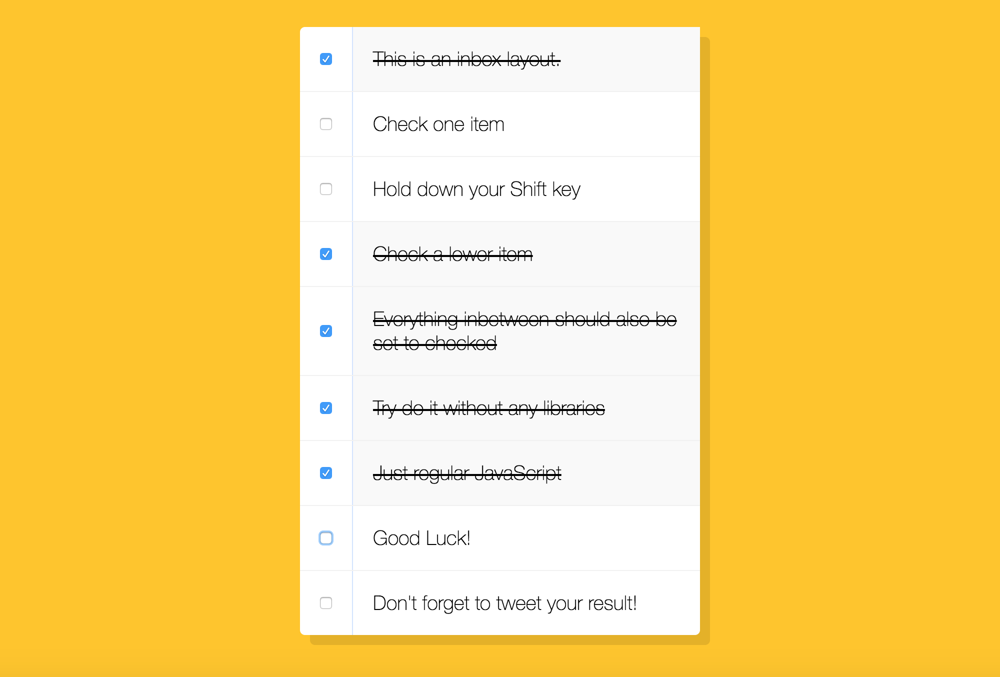

# Hold Shift and Check Checkboxes

## Objective:
We're given an HTML page that displays a collection of input HTML elements of type checkbox, each followed by a p HTML element that will have it's text contents striked through when an input is checked. Write the necessary JavaScript code to allow a user to select multiple items while holding down the shift key.

## Steps: 
- Declare an immediately invoked anonymous function that will contain the rest of the JavaScript code, so as to avoid polluting the global namespace.

- Declare & define a const variable as a reference to every input element that is a child of the inbox class.

  ``const checkBoxes = document.querySelectorAll('.inbox input[type="checkbox"]');``

- Declare a let variable that will be defined later as the last input that was selected.

  ``let lastSelected;``

- Iterate through the NodeList and add an event listener to each element that will call upon a yet-to-be-defined event handler function on a click event.

``// The name of the function to be used as the event handler is your choice.
checkBoxes.forEach(
  // In this example, the event handler function is called 'multiChecker'
  checkbox => checkbox.addEventListener('click', multiChecker)
);``

- Declare the event handler function and allow it accept one parameter, the event:

- Check if the let variable declared in step 2 has been defined & the shift key was pressed when this event occured.

- In the body of the conditional statement, set the checked property of the function context to be the checked property of the last input that was selected.

``if(checkbox === this || checkbox === lastChecked) {
          inbetween = !inbetween;
          console.log('Starting to check them inbetween!');
        }
        if (inbetween) {
          checkbox.checked = true;
        }
      });
    }
    lastChecked = this;
}``

